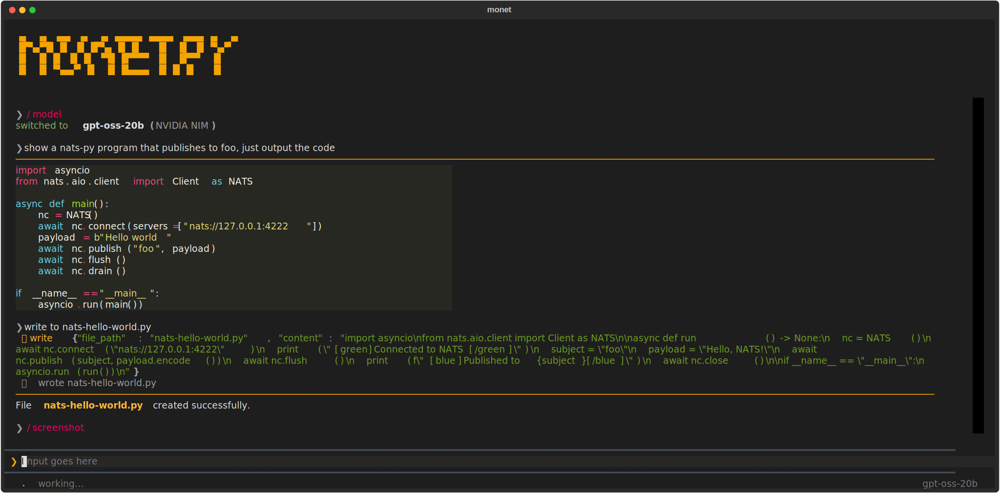

# monet.py

A simple [DSPy](https://github.com/stanfordnlp/dspy) based coding agent with a [Textual](https://textual.textualize.io/) TUI.



## Install

```bash
pip install monet-code
```

Or for development:

```bash
git clone https://github.com/wallyqs/monet.py.git
cd monet.py
uv sync
```

## Run

```bash
# Set API keys in .env (loaded automatically)
echo 'export ANTHROPIC_API_KEY=sk-...' >> .env

uv run monet
```

## Features

### ReAct-based chat

Chat uses [ReAct](https://dspy.ai/api/modules/ReAct/) for multi-step
reasoning with tool calling. The agent thinks, calls tools, observes
results, and iterates until it has an answer. The trajectory
(thinking, tool calls, results) is displayed in the content pane.

By pressing Ctrl-o you can toggle on/off thinking.

### Multi-provider model switching

Switch models at runtime with `/model` or `/model <name>`. The current
model is shown in the bottom-right corner of the status bar. 

| Provider   | Models                                                 |
|------------|--------------------------------------------------------|
| Anthropic  | claude-haiku-4-5, claude-sonnet-4, claude-opus-4       |
| OpenAI     | gpt-4o, gpt-4o-mini, o3, o4-mini                       |
| NVIDIA NIM | gpt-oss-20b, gpt-oss-120b, qwen3-coder-480b, kimi-k2.5 |

### Built-in coding tools

The agent has access to these tools:

| Tool               | Description                                            |
|--------------------|--------------------------------------------------------|
| `read`             | Read files with line numbers, offset, and limit        |
| `write`            | Write/create files (creates directories as needed)     |
| `edit`             | Exact string replacement with unified diff output      |
| `bash`             | Shell command execution with timeout                   |
| `grep`             | Regex search across files and directories              |
| `list_dir`         | List directory contents                                |
| `register_command` | Hot-load a slash command plugin from a Python file     |

### Self-extending

The agent can add new slash commands to itself at runtime via the
`register_command`. Ask it to "add a /greet monet command" and it
will: 

1. Create a plugin file at `.monet/commands/greet.py`
2. Call `register_command()` to activate it immediately
3. The command persists across restarts

Plugin files follow a simple convention:

```python
NAME = "/greet"
DESCRIPTION = "Greet someone"

def handler(app, args: str) -> None:
    log = app.query_one("#content")
    log.write(f"Hi {args.strip() or 'world'}!")
```

Commands can call `app.predict(signature, **kwargs)` to query the LLM using [DSPy Predict](https://dspy.ai/api/modules/Predict/):

```python
def handler(app, args: str) -> None:
    log = app.query_one("#content")
    result = app.predict("topic -> summary", topic=args.strip())
    log.write(result.get("summary", result.get("error", "")))
```

Commands also have full access to the [Textual](https://textual.textualize.io/) framework via the `app` object. For example, you can ask the agent: *"add a /screenshot monet command which uses app.save_screenshot()"* and it will generate:

```python
NAME = "/screenshot"
DESCRIPTION = "Take a screenshot of the current application"

def handler(app, args: str) -> None:
    log = app.query_one("#content")
    try:
        app.save_screenshot()
        log.write("Screenshot saved successfully.")
    except Exception as e:
        log.write(f"Error saving screenshot: {e}")
```

### Slash command completion

Type `/` to see available commands. `Tab` autocompletes from the filtered list. `ctrl+n` / `ctrl+p` navigate the picker.

### Input history

`ctrl+p` / `ctrl+n` navigate through previously submitted chat messages (when the command picker is not visible). Slash commands are not added to history. In-progress text is stashed and restored.

### Keyboard shortcuts

| Key      | Action                           |
|----------|----------------------------------|
| `?`      | Show shortcuts help              |
| `/`      | Show available commands          |
| `Tab`    | Autocomplete command name        |
| `ctrl+p` | History previous / picker up     |
| `ctrl+n` | History next / picker down       |
| `ctrl+o` | Toggle thinking block visibility |
| `esc`    | Cancel in-flight request         |
| `ctrl+z` | Suspend process                  |
| `ctrl+b` | Cursor back one character        |
| `ctrl+f` | Cursor forward one character     |
| `ctrl+k` | Kill to end of line              |
| `ctrl+y` | Yank (paste) killed text         |

### Response rendering

- Markdown with syntax-highlighted code blocks
- ReAct trajectory display (thinking, tool calls, tool results)
- Unified diffs with syntax highlighting after edits
- Animated spinner during LLM calls
- Text selection and auto-copy to clipboard
- Command output is kept in chat context for follow-up conversation

### UI behavior

- Banner auto-hides when content overflows
- Typing anywhere auto-focuses the input
- `ctrl+o` retroactively shows/hides all thinking blocks
- Current model shown in status bar

## Testing

```bash
uv run pytest
```
